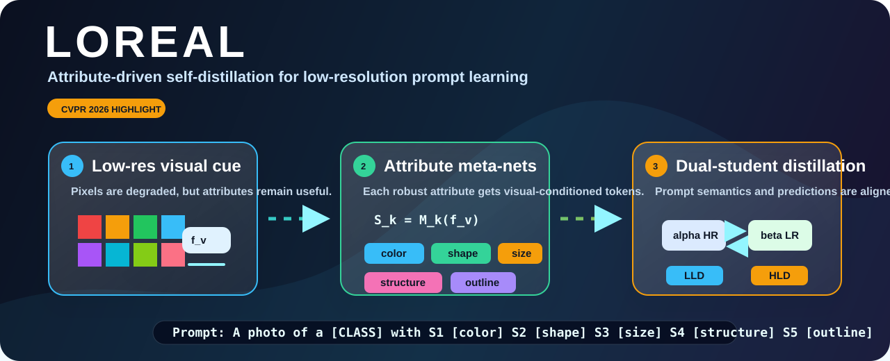

<div align="center">


# LOREAL: Mitigating Low-Resolution Challenges in Prompt Learning with Attribute-Driven Self-Distillation

<p>
  
  
  
  
</p>



</div>

## Overview

LOREAL is a prompt-learning framework for low-resolution vision-language recognition. It augments a CoOp-style prompt learner with attribute-conditioned prompt tokens and trains them through self-distillation between a standard-resolution branch and a low-resolution branch.

The repository contains:

- `CoOp` baseline training and evaluation.
- `CoOp_LOREAL`, the LOREAL trainer built on top of CoOp.
- Low-resolution image handling through Dassl transforms.
- Scripts for staged base-to-new experiments.
- Dataset configs for common prompt-learning benchmarks.

## Method

LOREAL keeps the CLIP backbone frozen and learns prompt-side adaptation. Given image features, small meta-networks generate attribute prompt tokens such as color, shape, size, structure, and outline. A standard-resolution student and a low-resolution student are then coupled with:

- Cross-entropy supervision on base classes.
- High-level distillation between prediction distributions.
- Low-level distillation between generated attribute contexts.

At inference time, the low-resolution branch uses image-conditioned attribute prompts for classification.

## Code Structure

| Path | Description |
| --- | --- |
| `train.py` | Main training and evaluation entry point |
| `trainers/coop.py` | CoOp baseline trainer |
| `trainers/coop_loreal.py` | LOREAL trainer |
| `configs/trainers/CoOp/` | CoOp configs |
| `configs/trainers/CoOp_LOREAL/` | LOREAL configs |
| `configs/datasets/` | Dataset configs |
| `scripts/run_coop_loreal.sh` | General staged LOREAL runner |
| `scripts/run_oxfordflowers_lr_base_new.sh` | Dataset-parameterized low-resolution base/new summary runner |
| `Dassl.pytorch/` | Local Dassl fork used by the trainers |

## Installation

Create an environment with PyTorch installed for your CUDA version, then install the project dependencies:

```bash
git clone https://github.com/xuc865/loreal.git
cd loreal

pip install -r requirements.txt
cd Dassl.pytorch
pip install -r requirements.txt
python setup.py develop
cd ..
```

If CLIP assets are not already cached, the first run will download them automatically.

## Datasets

Put datasets under a single root directory, for example:

```text
/path/to/datasets/
  oxford_flowers/
  oxford_pets/
  caltech-101/
  ...
```

Dataset-specific layouts follow the CoOp/Dassl conventions. See [docs/DATASETS.md](docs/DATASETS.md) for dataset names and expected files.

## Run

### General Runner

Use `scripts/run_coop_loreal.sh` for staged experiments on any supported dataset:

```bash
bash scripts/run_coop_loreal.sh \
  --data-root /path/to/datasets \
  --output-root /path/to/runs \
  --datasets oxford_flowers \
  --resolutions 96 \
  --seeds 1 \
  --stage all
```

Run multiple datasets, resolutions, and seeds by passing comma-separated lists:

```bash
bash scripts/run_coop_loreal.sh \
  --data-root /path/to/datasets \
  --output-root /path/to/runs \
  --datasets oxford_flowers,oxford_pets,caltech101 \
  --resolutions 96,144,192 \
  --seeds 1,2,3 \
  --shots 16 \
  --stage all
```

Common options:

| Option | Meaning |
| --- | --- |
| `--datasets` | Comma-separated dataset keys |
| `--resolutions` | Comma-separated low-resolution sizes |
| `--seeds` | Comma-separated random seeds |
| `--shots` | Number of base-class shots |
| `--stage` | `all`, `loreal`, `stage1`, `stage2`, `stage3`, or `stage4` |
| `--dry-run` | Print commands without executing them |

The staged pipeline is:

1. Train a standard-resolution CoOp teacher.
2. Train a low-resolution CoOp baseline.
3. Train LOREAL self-distillation.
4. Evaluate the low-resolution base/new splits.

### Base/New Summary Script

For a compact base/new run with an explicit summary file, use `scripts/run_oxfordflowers_lr_base_new.sh`. Despite the historical filename, the script is dataset-parameterized through `DATASET`:

```bash
DATA_ROOT=/path/to/datasets \
OUTPUT_ROOT=/path/to/runs \
DATASET=oxford_flowers \
SEED=1 \
RES=96 \
RESET_LOREAL=1 \
bash scripts/run_oxfordflowers_lr_base_new.sh
```

Use another supported dataset by changing `DATASET`:

```bash
DATA_ROOT=/path/to/datasets \
OUTPUT_ROOT=/path/to/runs \
DATASET=oxford_pets \
SEED=1 \
RES=96 \
RESET_LOREAL=1 \
bash scripts/run_oxfordflowers_lr_base_new.sh
```

Results and logs are written under:

```text
$OUTPUT_ROOT/logs/CoOp_LOREAL/$DATASET/res$RES/seed$SEED/
$OUTPUT_ROOT/output/CoOp_LOREAL/base2new/train_base/$DATASET/
```

The summary file is:

```text
$OUTPUT_ROOT/logs/CoOp_LOREAL/$DATASET/res$RES/seed$SEED/lr_base_new_summary.txt
```

## Useful Environment Overrides

The example script exposes common experiment knobs through environment variables:

```bash
DATASET=oxford_flowers
SEED=2
RES=96
LOREAL_DIM=64
LOREAL_COEF1=0.5
LOREAL_COEF2=1.0
LOREAL_N_ATT=1
LOREAL_PROMPT_ORDER=ctx_attr_cls
```

Example:

```bash
DATASET=oxford_pets SEED=2 RESET_LOREAL=1 LOREAL_DIM=64 bash scripts/run_oxfordflowers_lr_base_new.sh
```

## Acknowledgements

This codebase builds on:

- [CoOp](https://github.com/KaiyangZhou/CoOp)
- [Dassl.pytorch](https://github.com/KaiyangZhou/Dassl.pytorch)
- [CLIP](https://github.com/openai/CLIP)
- [DPC](https://github.com/jreion/dpc)
- [ATPrompt](https://github.com/zhengli97/ATPrompt)

## Citation

```bibtex
@inproceedings{wang2026loreal,
  title={LOREAL: Mitigating Low-Resolution Challenges in Vision-Language Models with Attribute-driven Prompt Self-Distillation},
  author={Wang, Xucong and Wang, Pengkun and Zhao, Zhe and Yu, Liheng and Mao, Rui and Wang, Yang},
  booktitle={Proceedings of the IEEE/CVF Conference on Computer Vision and Pattern Recognition},
  pages={39152--39163},
  year={2026}
}
```
